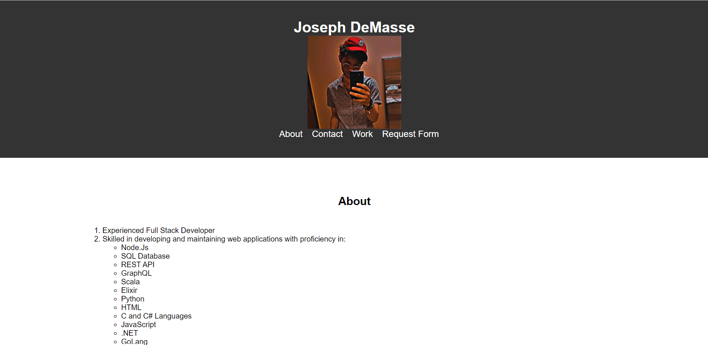

# DevDeMasse
This is a repository for my personal portfolio accessible through Github pages ! 
## Table of Contents

- [Installation](#installation)
- [Usage](#usage)
- [Contributing](#contributing)
- [Screenshots](#screenshots)
- [License](#license)

## Installation

To use this website locally, you can clone the repository using the following command:

```
git clone https://github.com/okjay50/DevDeMasse.git
```

## Usage

Once you have cloned the repository, you can open the `index.html` file in your web browser to view the website.

This website contains information on the speakers, schedules, and topics of discussion for the upcoming DevDeMasse conference. You can use the navigation menu at the top of the page to explore the different sections of the website.
You may also use the Github Pages Link : https://okjay50.github.io/DevDeMasse/

## Contributing

Contributions are welcome! If you have any suggestions or would like to help improve this project, please feel free to open an issue or submit a pull request.

## Screenshots



## License

This project is licensed under the [MIT License](./LICENSE).
